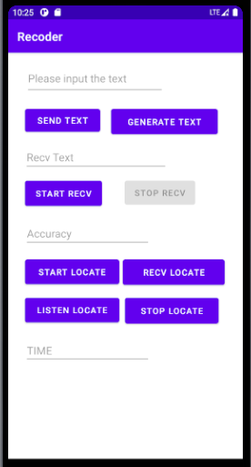

### 声波信号模拟蓝牙通信

```bash
# 切换到相应分支
git checkout test-message
```

将项目在`Android Studio`打开，运行或者生成apk


首先在接收方设备上点击`START RECV`按钮，并在接收方设备上输入发送方要发送的文本（用于计算传输比特准确率），在发送方设备上最上方输入要发送的文本，然后点击`SEND TEXT`即可，接收方接收到后会在`Recv Text`文本框中显示收到的文本，并在下面的`Accuracy`文本框中显示传输比特正确率；点击`STOP RECV`可以停止接收，点击`GENERATE TEXT`可生成随机文本；发送方在发送时会在下面`Time`文本框显示当前时间（ms为单位），接收方接收完毕后也会在该位置显示当前时间，用于计算传输耗时


### 声波测距

```bash
git checkout master
```

将项目在`Android Studio`打开，运行或生成apk



首先在设备A上点击`LISTEN LOCATE`按钮，接着在设备B上点击`RECV LOCATE`按钮，然后在设备A上点击`START LOCATE`按钮，设备A会发送信号，设备B监听到后等待约1s，会发送信号，测距完毕后设备A和设备B会在`TIME`文本框中显示各自的时间差（ms为单位），通过时间差按照公式即可计算距离

