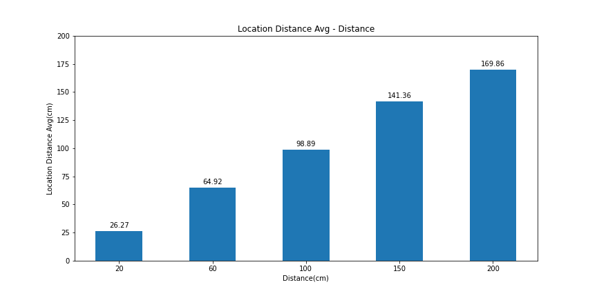
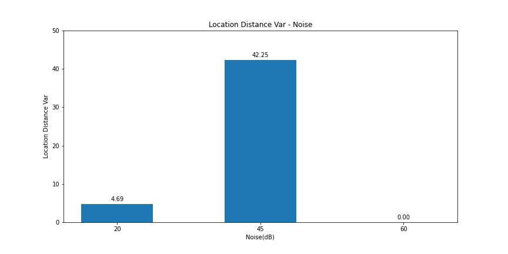

## 声波信号模拟蓝牙通信

### 协议设计

- 编码方式：使用6000Hz和10000Hz分别对1和0进行FSK调制，窗口长度为10ms，得到音频信号
- 数据包格式：每个数据包由前导码，数据长度，总帧数以及负载数据组成；前导码为10101010，占一个字节，用于标识数据包起始位置；数据长度代表负载数据的字节数，占一个字节；总帧数代表数据分段后发送的数据包总数目，占用一个字节，用于识别数据分段情况，数据分段大小为255个字节；负载数据即实际要发送的数据

### 功能实现

- [x] 支持传输任意文本数据，包括中英文等
- [x] 支持数据分段发送，分包大小为255个字节

### 实现逻辑

- 发送端：首先得到文本数据的`utf-8`字节编码形式，再对负载数据加上前导码，数据长度以及总帧数信息封装为数据包后，将数据包转为比特序列，再对比特序列使用规定的编码方式进行调制，得到要发送的音频信号，进行发送
- 接收端：实时对接收到的音频信号进行处理，首先将信号置入缓冲区，每次对缓冲区中的信号进行逐段滑动，得到一系列窗口，对该一系列窗口进行傅里叶变换后，可得到前导码首比特的编码频率的幅值序列，若该幅值序列中达到设定好的阈值，则对其进行准确定位到起始窗口位置，并解码后面的比特序列，若为前导码，则根据规定的数据包格式，获取数据长度、总帧数及实际负载数据等

### 性能测量结果

> 由于设置的分段大小为255个字节，而在测试过程中使用20字节长度的数据，因此若出现一个bit错误，则记作该数据包丢失，因此测得的丢包率即该单个数据包是否完全正确

#### 距离对传输性能的影响

数据记录

| 距离(cm) | 误码率%(三次平行试验) |       |       | 平均误码率% | 丢包率% |
| -------: | --------------------: | ----: | ----: | ----------: | ------- |
|       20 |                  0.00 |  0.00 |  0.00 |        0.00 | 0.00    |
|       40 |                  4.37 | 14.37 |  0.00 |        6.24 | 66.67   |
|       60 |                 15.62 | 45.63 | 19.37 |       26.87 | 100.00  |
|       80 |                 20.62 |  6.25 |  0.62 |        9.16 | 100.00  |
|      100 |                 36.87 | 84.37 | 82.50 |       67.91 | 100.00  |

误码率柱状图

丢包率柱状图

可以看到随着距离的提升，误码率和丢包率呈上升趋势，距离越大，信号在信道传输的过程中多径效应越强，衰减越快，对信号解码错误率会更高

#### 抗干扰能力

数据记录

| 噪声强度(dB) | 误码率%(三次平行试验) |      |      | 平均误码率% | 丢包率% |
| -----------: | --------------------: | ---: | ---: | ----------: | ------- |
|           20 |                  3.12 | 1.25 | 0.62 |        1.66 | 100.00  |
|           45 |                  0.00 | 3.12 | 0.62 |        1.25 | 66.67   |
|           60 |                  3.12 | 0.62 | 3.12 |        2.29 | 100.00  |

误码率柱状图

丢包率柱状图

可以看到抗干扰能力较强，噪声强度的增大对传输性能没有很大的影响，主要原因可能是模拟的环境的噪声的频率未对信号传输的频率造成干扰，而不会影响到实际的解码过程

#### 遮挡影响

数据记录

| 遮挡厚度(cm) | 误码率%(三次平行试验) |      |        | 平均误码率% | 丢包率% |
| -----------: | --------------------: | ---: | -----: | ----------: | ------- |
|            1 |                  1.25 |   40 |   8.12 |       16.46 | 100.00  |
|            5 |                100.00 |  100 | 100.00 |      100.00 | 100.00  |
|           10 |                100.00 |  100 | 100.00 |      100.00 | 100.00  |
|           20 |                100.00 |  100 | 100.00 |      100.00 | 100.00  |

误码率柱状图

丢包率柱状图

在实际实验过程中，发现当遮挡厚度达到5cm后，数据长度及总帧数在传输过程中会出现解码错误，从而造成负载数据的解码出现错误，得不到实际的完整负载数据，导致后面的误码率计算得到均为100%，主要原因可能是随着遮挡厚度变大，信号在传输过程中的衰减越大，因反射造成的多径效应越强，从而导致经过信道传输后的数据误码率较高

#### 解码算法性能

对提供的音频进行解码，得到所有数据包的误码率均为$0\%$，丢包率为$0\%$，耗时$311ms$

误码率折线图

## 声波测距

### 测距方法

整体设计参考`beepbeep`算法，首先规定发送信号均为01010101序列，并使用10000Hz和6000Hz分别对0和1进行FSK调制得到信号音频；假设有两个设备分别为设备A和设备B，首先设备A发送信号，同时记录自己发送的信号到达的时间节点，设备B接收到设备A的信号后，同时记录设备A信号到达的时间节点，等待1s后，设备B发送信号，同时记录自己发送的信号到达的时间节点，设备A接收到设备B信号后，同时记录设备B信号到达的时间节点，最后设备A和设备B都可得到两个时间点之间的时间插值，假设分别为$t_A$和$t_B$，则距离$d=\frac{C}{2}(t_A-t_B)+d_{AA}+d_{BB}$，其中$C$为声波传输速度，$d_{AA}$为设备A的扬声器和麦克风之间的距离，$d_{BB}$为设备B的扬声器和麦克风之间的距离

### 功能实现

- [x] 设备定位测距

### 实现逻辑

- 设备A：首先发送信号，并同时监测自己的信号，获得该信号的起始窗口位置，并继续监测设备B的信号，获得设备B发送的信号的起始窗口位置，作差可得到两个信号起始窗口位置间的信号长度，除以采样率即可得到时间差
- 设备B：首先监测设备A发送的信号，获得该信号的起始窗口位置，等待1s后，发送信号，并同时监测自己发送的信号，获得该信号的起始窗口位置，作差可得到两个信号起始窗口间的信号长度，除以采样率即可得到时间差

### 性能测量结果

#### 距离对性能的影响

数据记录

| 实际距离(cm) | 测距结果(三次平行试验cm) |        |        | 平均测距结果(cm) |   方差 |
| -----------: | -----------------------: | -----: | -----: | ---------------: | -----: |
|           20 |                    26.27 |  30.02 |  22.52 |            26.27 |  14.08 |
|           60 |                    48.41 |  71.30 |  75.06 |            64.92 | 208.02 |
|          100 |                   110.37 |  87.85 |  98.44 |            98.89 | 126.92 |
|          150 |                   142.61 | 142.61 | 138.85 |           141.36 |   4.69 |
|          200 |                   172.63 | 165.31 | 171.64 |           169.86 |  15.76 |

平均测距结果柱状图

测距方差柱状图

可以看到随着实际距离增大，平均测距结果相比于实际距离的误差越大，主要原因可能是随着距离的增大，信号的衰减程度越大，同时多径效应的增强也会使得定位信号的起始窗口位置出现偏差；方差也呈上升趋势，其中方差柱状图中100cm和200cm时偏小可能是因为测距环境比较一致，三次平行试验的结果较为接近

#### 环境噪声影响

数据记录

| 噪声强度(dB) | 测距结果(三次平行试验cm) |        |        | 平均测距结果(cm) |  方差 |
| -----------: | -----------------------: | -----: | -----: | ---------------: | ----: |
|           20 |                    90.07 |  93.82 |  93.82 |            92.57 |  4.69 |
|           45 |                   112.59 | 101.33 | 101.33 |           105.08 | 42.25 |
|           60 |                   101.33 | 101.33 | 101.33 |           101.33 |  0.00 |

平均测距结果柱状图

测距方差柱状图

可以看到随着噪声强度的增大，对测距性能没有很大的影响，测距结果均接近100cm左右，主要原因可能是模拟的环境的噪声的频率未对信号编码的频率造成干扰，而不会影响到实际的信号起始窗口定位，从而不会对测距造成很大的影响

#### 环境遮挡影响

数据记录

| 遮挡厚度(cm) | 测距结果(三次平行试验cm) |         |         | 平均测距结果(cm) |      方差 |
| -----------: | -----------------------: | ------: | ------: | ---------------: | --------: |
|            1 |                    82.56 |  356.52 |  472.86 |           303.98 |  40152.71 |
|            5 |                   799.35 | 1493.63 | 1080.82 |          1124.60 | 121942.37 |
|           10 |                  1790.10 |  120.09 |  754.32 |           888.17 | 710671.47 |
|           20 |                   472.86 |  844.39 |  637.98 |           651.74 |  34650.53 |

平均测距结果柱状图

测距方差柱状图

可以看到遮挡对测距性能的影响很大，在遮挡影响下，平均测距结果相比于实际距离100cm都有很大的偏移，且随着遮挡厚度的增加，对测距性能的影响越大，包括平均测距结果偏差更大，测距方差更大，主要原因可能是遮挡造成的信号衰减及多径效应给实际信号的起始窗口定位造成了很大的偏差，影响到时间差的计算，从而造成很大的测距偏移

